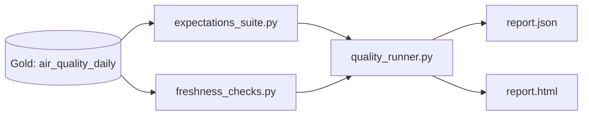

# Observabilidade e Qualidade de Dados

Aplica **Great Expectations** e checagens
customizadas de frescor/completude sobre a camada Gold construida nos
Projetos 03/04, gerando um dashboard HTML de monitoramento e um
relatorio JSON reaproveitavel.

Projeto 06 de uma serie de 6 documentando minha transicao de Analista
de Dados para Engenharia/Arquitetura de Dados - veja o [perfil
completo](https://github.com/amanda-martins-data).

## Arquitetura



Decisoes de arquitetura e trade-offs documentados em
[`docs/architecture.md`](docs/architecture.md).

## Stack

`Python` · `Great Expectations` · `pandas` · `pytest`

## Estrutura

```
.
├── src/
│   ├── expectations_suite.py   # regras do Great Expectations (schema/valor)
│   ├── freshness_checks.py     # checagens de frescor e completude - Python puro
│   ├── quality_runner.py       # orquestra GX + checagens customizadas
│   ├── report_generator.py     # gera o dashboard HTML estatico
│   └── run_quality_checks.py   # CLI
├── tests/                      # 17 testes, 6 deles rodando o GX de verdade
└── docs/architecture.md
```

## Como rodar

```bash
pip install -r requirements.txt

# 1. Rodar a suite de testes (inclui validacoes reais do Great Expectations)
python -m pytest tests/ -v

# 2. Rodar as checagens sobre um arquivo real da camada Gold
python src/run_quality_checks.py caminho/para/air_quality_daily.json \
    --cidades "Sao Paulo,Rio de Janeiro,Belo Horizonte" \
    --poluentes "pm25,pm10,o3,no2,co" \
    --saida ./out

# gera ./out/report.json e ./out/report.html
```

O CLI retorna codigo de saida `1` quando alguma checagem falha, para
uso direto em CI (ex.: GitHub Actions falhando o job se a qualidade
cair).

## Validacao

Diferente dos Projetos 04 e 05, este projeto nao precisou de nenhuma
credencial externa indisponivel no ambiente de desenvolvimento - o
Great Expectations roda inteiramente local. Resultado: **17/17 testes
passando**, sendo 6 deles execucoes reais do Great Expectations
(contexto efemero, sem mock), cobrindo deteccao de parametro invalido,
valores fora de faixa, inconsistencia entre `min_value`/`max_value`,
dado desatualizado e cidade ausente na carga mais recente. Detalhes em
[`docs/architecture.md`](docs/architecture.md).

## Proximos passos do portfolio

Este e o ultimo projeto da serie de 6. O proximo passo natural do
portfolio como um todo e a integracao entre projetos ja documentada ao
longo do caminho: rodar o pipeline do Projeto 02 (Airflow) chamando as
tres camadas do Projeto 03, provisionadas pelo Projeto 04, com a
camada de qualidade deste projeto alimentando o agente de IA do
Projeto 05.
