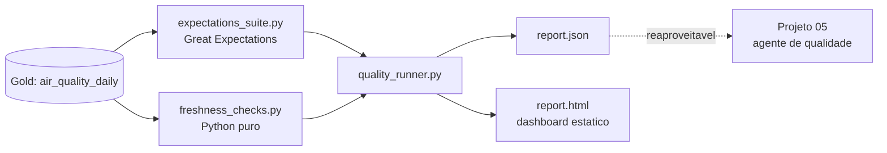

# Arquitetura - Observabilidade e Qualidade de Dados

## Visao geral

Aplica Great Expectations e checagens de frescor/completude sobre a
camada Gold construida nos Projetos 03/04, produzindo um dashboard de
monitoramento e um relatorio JSON reaproveitavel.

## Decisoes e trade-offs

### 1. Great Expectations de verdade, nao uma simulacao
Este projeto instala e roda o Great Expectations 1.x de verdade,
em modo `ephemeral` (contexto em memoria, sem exigir um projeto GX
completo em disco nem conexao com o GX Cloud). Isso significa que os
testes deste projeto rodam validacoes reais, nao uma reimplementacao
caseira do que o GX faria.

### 2. Expectations de linha (GX) separadas de checagens de carga (Python puro)
`expectations_suite.py` valida colunas e valores individuais (nulo,
faixa, categoria). `freshness_checks.py` valida a carga como um todo
("os dados de hoje chegaram?", "todas as cidades estao presentes?").
Sao duas categorias de falha genuinamente diferentes - um pipeline
pode ter linhas perfeitas e ainda assim estar processando dados de
tres dias atras, ou faltando uma cidade inteira. Misturar as duas
categorias na mesma ferramenta esconderia essa diferenca.

### 3. Nomes de checagem legiveis, nao nomes de classe do GX
`build_expectations()` retorna pares `(nome_legivel, expectation)`.
O relatorio final mostra "avg_value deve estar num intervalo
plausivel", nao `ExpectColumnValuesToBeBetween`. Quem le o dashboard
para decidir se confia nos dados de hoje normalmente nao conhece a
API do Great Expectations.

### 4. Dashboard HTML autocontido, sem JavaScript nem dependencia de rede
`report_generator.py` gera um unico arquivo HTML com CSS embutido -
abre em qualquer navegador, sem servidor, sem CDN. Para uma checagem
diaria de qualidade, isso e mais simples de distribuir (por e-mail,
por Slack, como artefato de CI) do que subir uma aplicacao web.

### 5. Sem emojis em nenhum artefato gerado
Status e comunicado por texto (`PASS`/`FAIL`) mais cor, nunca por
icone. Isso mantem o relatorio legivel em qualquer terminal, leitor de
tela, log de CI ou impressao em preto e branco - e e testado
explicitamente (`test_report_contains_no_emoji`).

### 6. `report.json` como ponte para o Projeto 05
O relatorio JSON gerado aqui tem o mesmo formato que alimentaria
naturalmente o agente de qualidade do Projeto 05: uma lista de
checagens com nome, categoria, sucesso e detalhes. Rodar o agente de
IA em cima deste relatorio (em vez de sobre anomalias estatisticas
brutas) e o proximo passo natural de integracao entre os dois
projetos.

## Validacao

Diferente dos Projetos 04 e 05 (que precisaram de credenciais externas
indisponiveis neste ambiente), o Great Expectations roda inteiramente
local e foi testado de verdade, sem nenhum tipo de simulacao:
- **17/17 testes passando**, sendo 6 deles rodando o Great Expectations
  real (contexto efemero) contra DataFrames de teste, cobrindo deteccao
  de parametro invalido, valor negativo, `min_value > max_value`,
  dado desatualizado e cidade ausente.
- CLI testado de ponta a ponta manualmente com um arquivo JSON de
  exemplo, gerando `report.json` e `report.html` corretos e retornando
  codigo de saida 1 quando ha falhas (para integracao com CI).
- Nenhuma parte deste projeto foi deixada sem teste real por falta de
  credenciais - e a primeira vez na serie em que 100% da logica roda
  contra a ferramenta real, nao contra um substituto.

## Limitacoes conhecidas / proximos passos
- Sem persistencia historica dos relatorios (cada execucao e
  independente) - um proximo passo natural seria gravar o `report.json`
  de cada dia no proprio data lake do Projeto 03, permitindo ver a
  evolucao da qualidade ao longo do tempo.
- Sem integracao de fato com o Projeto 05 ainda (documentada como
  proximo passo, nao implementada).
- Sem alertas automaticos (e-mail/Slack) quando uma checagem falha -
  hoje o unico "alerta" e o codigo de saida do CLI.
